# 🌐 LocalServe – Local Service Discovery & Booking Platform  

## 🏆 Built during **Hack-It-Out 2.0 Hackathon (Jan 2026)** — 🥈 Runner-Up, Web Development Track

A modern full-stack service-marketplace that connects **customers** with **local vendors** such as electricians, plumbers, tutors, mechanics, and home services.  
Built with **React.js**, professional UI/UX, role-based navigation, vendor dashboards, review system, and fully localStorage-driven data persistence.

---

## 📘 Table of Contents
- [Project Overview](#project-overview)
- [Features](#features)
  - [Guest Features](#guest-features)
  - [Customer Features](#customer-features)
  - [Vendor Features](#vendor-features)
- [Tech Stack Used](#tech-stack-used)
- [Folder Structure](#folder-structure)
- [How Data Is Stored](#how-data-is-stored)
- [How to Run the Project](#how-to-run-the-project)
- [Future Enhancements](#future-enhancements)
- [Screenshots (optional)](#screenshots-optional)

---

## 📌 Project Overview

**LocalServe** is built to simplify how people find and hire trusted local service experts.  
It supports **three user roles**:

### 1️⃣ Customer
- Explore all services openly
- Must login to view details or book
- Can request services, add favorites, write/edit reviews

### 2️⃣ Vendor
- View and manage customer requests  
- Update profile (name, description, phone, location)  
- See ratings & reviews  
- Manage job status
  
### 3️⃣ Admin
- Moderates all services
- Controls service visibility
- Manages platform integrity

Sessions and data are stored using **LocalStorage** so the app works fully without a backend.
LocalServe was designed to demonstrate how a scalable, role-based service marketplace can be built using modern frontend practices without a backend dependency.

---

## 👥 Team & Contributions

This project was developed as a **team effort** during the *Hack-It-Out 2.0 Hackathon*.  
Each member contributed to specific modules of the application.

### 👩‍💻 Minal Maurya
- Service Provider (Vendor) module UI development  
- Vendor dashboard implementation  
- Analytics dashboards for **Admin** and **Service Provider** panels  
- Data visualization and performance insights  
- Role-based feature integration for vendors

### 👩‍💻 Prachi Tripathi
- Customer-side UI design and implementation  
- Service discovery pages and user flow  
- Favorites, requests, and customer interaction features  

### 👩‍💻 Siddhi Gaikar
- Admin-side UI development  
- Service moderation interface  
- Admin panel layouts and navigation  

This collaboration ensured clear role separation, efficient development, and successful delivery within hackathon timelines.
> ⏱️ Built within strict hackathon timelines, focusing on clarity, usability, and role-based system design rather than backend integration.
---

## ⭐ Features

### 👀 Guest Features
- Browse all service cards  
- Rating & location visible  
- Clicking a card shows an **auth popup** asking to Login/Signup  
- Only role = `guest` or no-session gets blocked  
- Public pages: Home, About, Contact  

---

### 🧑‍💼 Customer Features

#### 🔐 Authentication
- Login / Signup with role = customer  
- Session saved in LocalStorage  
- Navbar changes after login  

#### 🔍 Service Discovery
- Category badge  
- Verified badge  
- Status indicator (Available / Busy / Offline)  
- Star ratings (full/half/empty)  
- Add/remove favorites  

#### 📄 Service Details Page
- Full service description  
- Reviews by customers  
- Add review  
- Edit review  
- Submit service request form  

#### 📦 My Requests
- List of all requests  
- Status tracking (“Pending”, “Accepted”, “Rejected”)  

#### ❤️ Favorites
- Saved using LocalStorage  
- Accessible anytime  

---

### 👨‍🔧 Vendor Features

#### 🏠 Vendor Dashboard
- Hero section with vendor profile  
- Total requests, Pending, Accepted counts  
- Average rating  
- Performance insights  

#### 📩 Vendor Requests Page
- View all customer requests  
- Accept/Reject buttons  
- Shows urgency, date, customer message  
- Auto-updates localStorage  

#### ⭐ Vendor Reviews Page
- Review summary  
- Ratings bar graph  
- Filter by stars  
- Sort by newest/oldest  
- Shows customer name, review, date  
---

### 🛡️ Admin Features

#### 🧭 Admin Dashboard
- View all services (static + vendor-created)
- Filter by status: Pending, Approved, Rejected, Removed
- Analytics cards for service counts and moderation activity

#### ✅ Service Moderation
- Approve services (visible to customers)
- Reject services (kept for review)
- Remove services (hidden from platform)
- Restore removed services back to pending
- Rejected services remain visible to admins for review
- Removed services are fully hidden from customers but can be restored

#### 🔔 Vendor Notifications
- Vendors receive notifications when:
  - Service is approved
  - Service is rejected
  - Service is removed
  - Service is restored
- Notifications stored and managed via LocalStorage

This module enforces **role-based access control**, ensuring only admins can manage platform-wide service visibility.
---

## 🛠 Tech Stack Used

### ✔ Frontend
| Technology | Usage |
|-----------|--------|
| **React.js** | UI components |
| **React Router** | Navigation, protected routes |
| **Bootstrap 5** | Responsive UI |
| **Framer Motion** | Page & element animations |
| **React Icons** | Icons |
| **LocalStorage API** | User sessions, requests, vendor data |

### ✔ Backend (Future-ready)
Currently LocalStorage-based, but structured for:
- Node.js / Express  
- MongoDB / PostgreSQL  
- JWT authentication  
- Cloud file storage  
---

## 📸 Screenshots & UI Walkthrough

Below are selected screenshots showcasing different user roles and key features of **LocalServe**.

---

### 👀 Guest Experience
Browse services without login and get prompted for authentication on action.

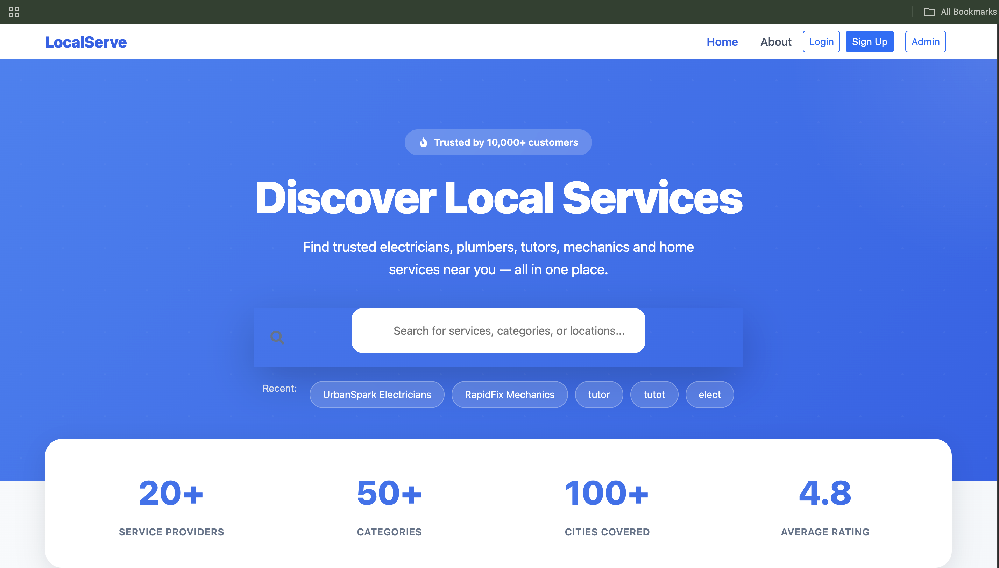
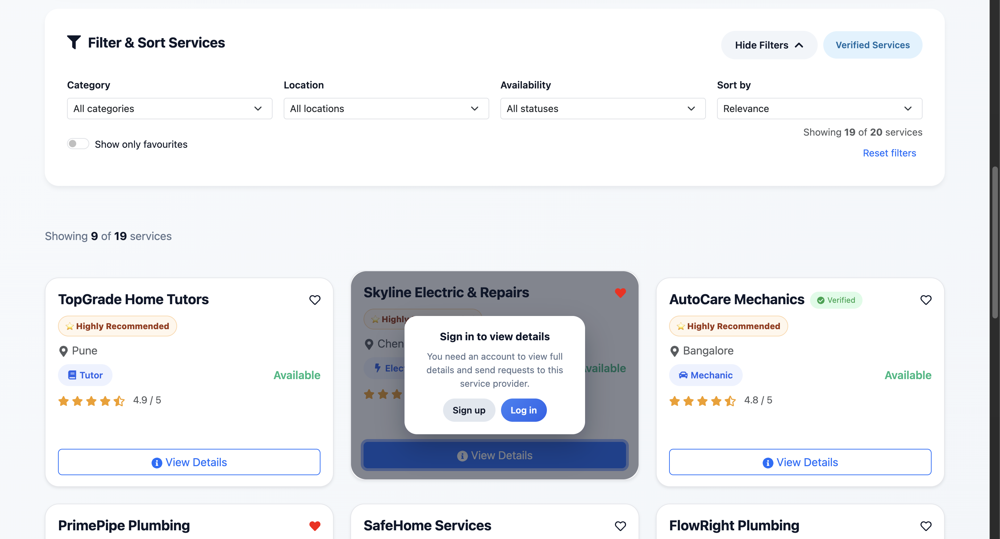

---

### 🧑‍💼 Customer Flow
Service details, requests, and request tracking.

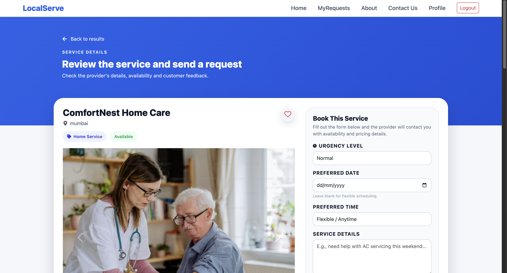
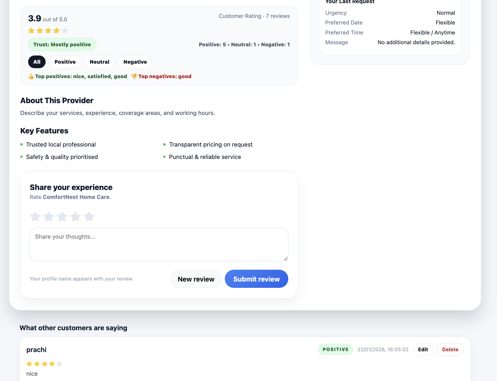
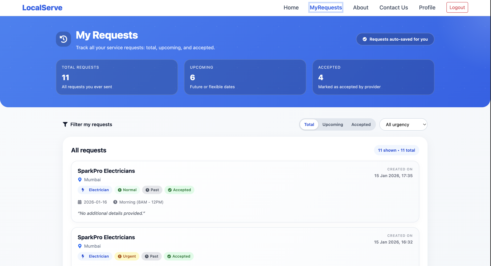

---

### 👨‍🔧 Service Provider (Vendor) Dashboard
Vendor analytics, profile management, and reviews.

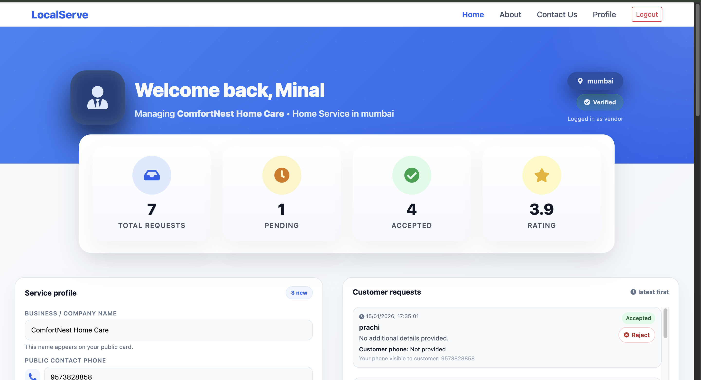
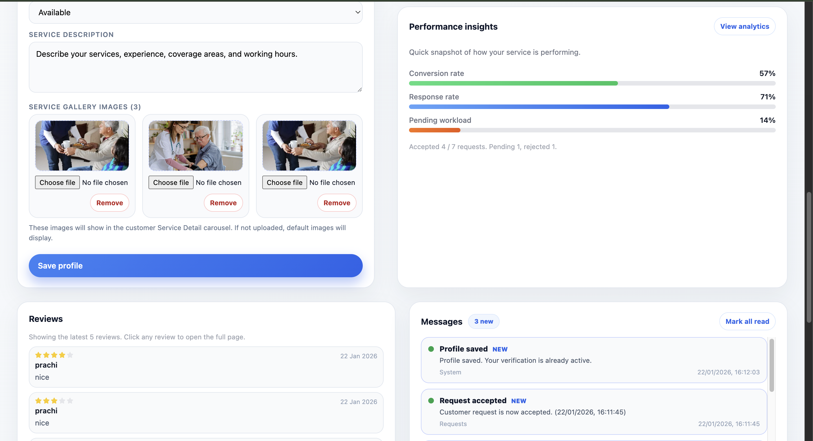
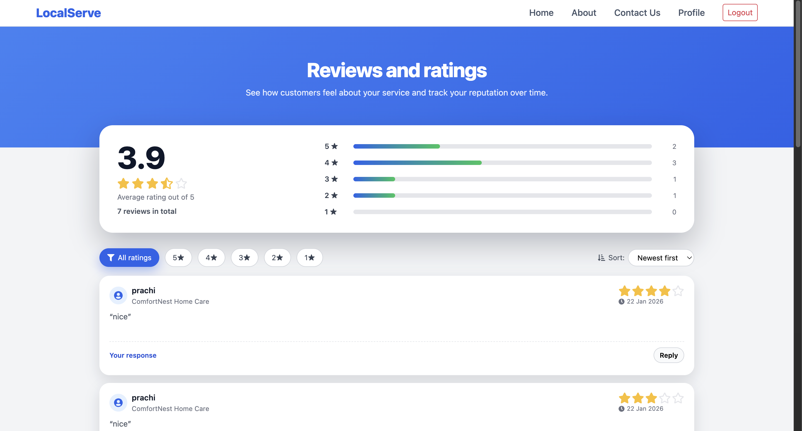

---

### 🛡️ Admin Panel
Service moderation, analytics, and removed services management.

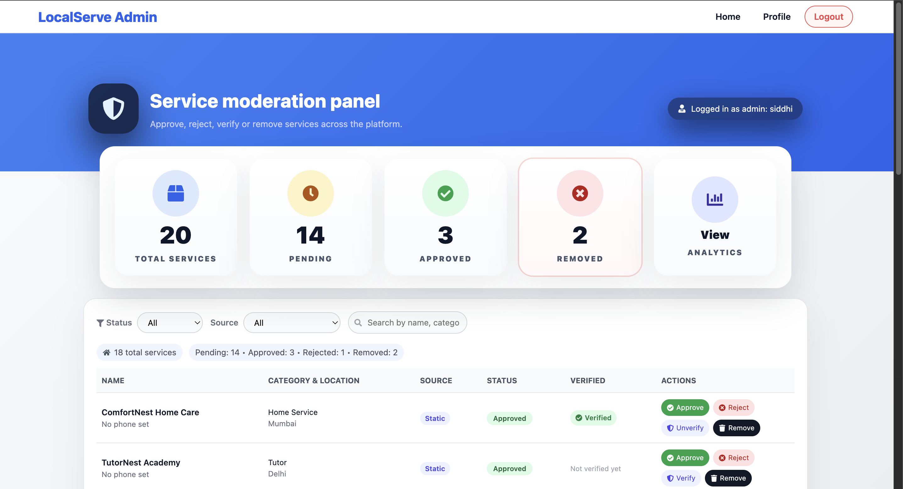
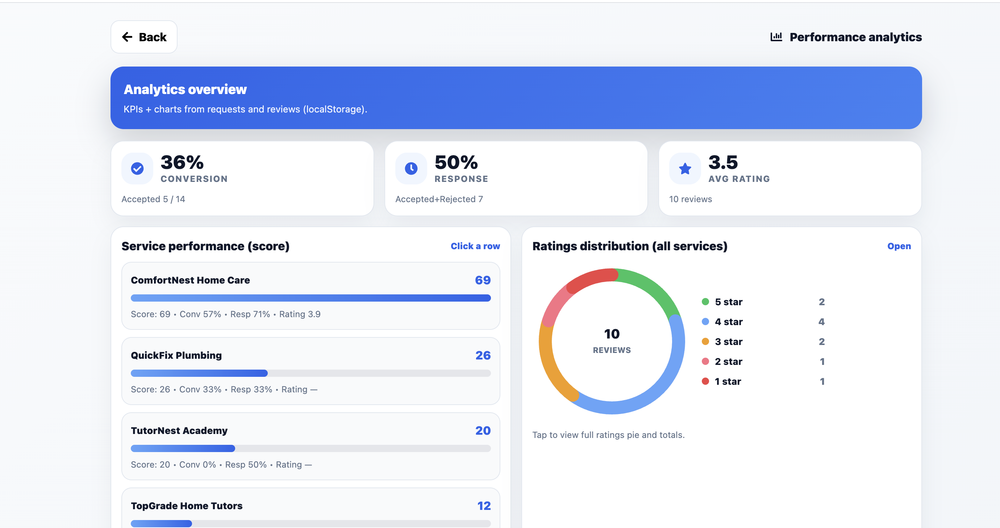
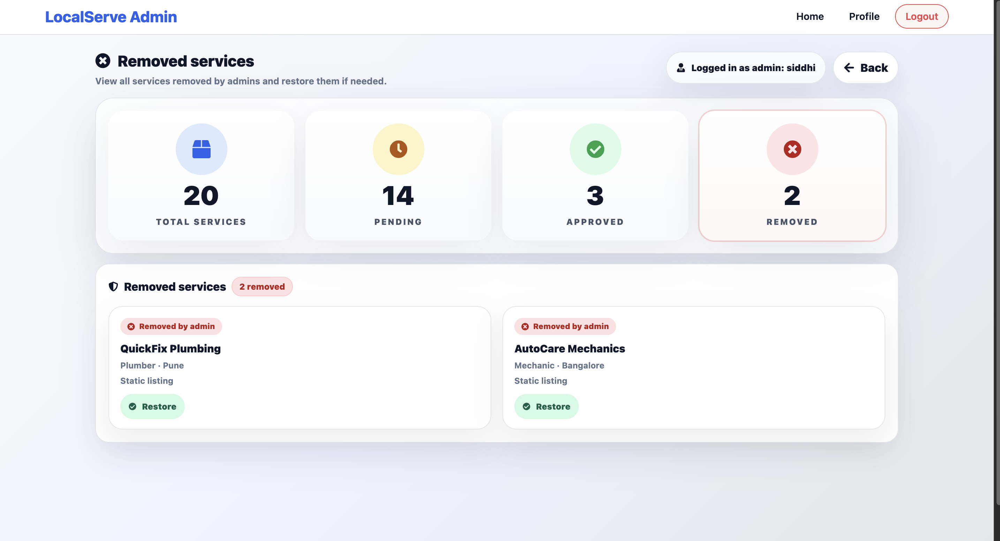


--

## 📂 Folder Structure

Your project contains **exactly these files**, and the README now includes them:

```text
src/
├── components/
│   ├── Admin/
│   │   ├── AdminAnalyticsOverview.js
│   │   ├── AdminAnalyticsRatings.js
│   │   ├── AdminAnalyticsService.js
│   │   ├── AdminRejectedServicesPage.js
│   │   ├── AdminServicesPage.js
│   │   ├── adminHeader.js
│   │   ├── adminLogin.js
│   │   ├── adminProfile.js
│   │   └── adminSignup.js
│   │
│   ├── layout/
│   │   ├── Header.js
│   │   ├── Footer.js
│   │   ├── Home.js
│   │   ├── About.js
│   │   ├── Contact.js
│   │   ├── Login.js
│   │   ├── Signup.js
│   │   ├── Profile.js
│   │   ├── MyRequests.js
│   │   ├── Shortlist.js
│   │   └── NotFound.js
│   │
│   ├── service/
│   │   ├── ServiceCard.js
│   │   ├── ServiceDetails.js
│   │   ├── ServiceFilters.js
│   │   └── ServiceReviewForm.js
│   │
│   ├── vendors/
│   │   ├── VendorAnalyticsPage.js
│   │   ├── VendorDashboard.js
│   │   ├── VendorRequestsPage.js
│   │   └── VendorReviewsPage.js
│   │
│   ├── states/
│   │   ├── EmptyState.js
│   │   └── Loading.js
│   │
│   └── ui/
│
├── data/
│   └── services.json
│
├── hooks/
│   └── useServiceDiscovery.js
│
├── styles/
│   └── theme.css
│
├── utils/
│   ├── getMergedServices.js
│   ├── reviewInsights.js
│   └── smartRanking.js
│
├── App.js
├── index.js
└── index.css


```


## 🧱 How Data Is Stored

LocalServe uses the browser's **LocalStorage** to simulate a backend database.  
Below is the list of keys and what each one stores:

| LocalStorage Key | Purpose |
|------------------|---------|
| **authUser** | Stores logged-in user details (name, email, role = customer/vendor). |
| **local-service-discovery:services** | Stores the published list of services (both static + vendor-created). |
| **local-service-discovery:favorites** | Stores the IDs of services the customer added to Favorites. |
| **local-service-discovery:contact-requests** | Stores all customer → vendor service requests, with status updates like Pending/Accepted/Rejected. |
| **local-service-discovery:vendor-profiles** | Stores vendor profile details (company name, phone, location, availability, description). |
| **local-service-discovery:vendor-reviews** | Stores all submitted reviews for services, with customer name, rating, comment, and timestamp. |

### 📌 Notes
- All data persists until manually cleared.  
- Perfect for demos, frontend projects, UI/UX testing, and offline simulation.  
- Can be replaced later with a backend (Node/Express + MongoDB/PostgreSQL).

---

## 🔐 Role-Based Access Control (RBAC)

LocalServe enforces strict role-based navigation:

| Role | Access |
|-----|-------|
| Guest | Browse services only |
| Customer | Request services, favorites, reviews |
| Vendor | Dashboard, requests, reviews |
| Admin | Service moderation, analytics, notifications |

Protected routes ensure unauthorized users cannot access restricted pages.

---

## 🚀 How to Run the Project
Prerequisites
	-	Node.js (v16+ recommended)
	-	npm (installed with Node)

## 📁 Run the Project

```bash
cd local-service-discovery
npm install
npm start
```
## 🌐 After Starting
	-	App runs at: http://localhost:3000
	-	Hot reload enabled
	-	No server restart needed


